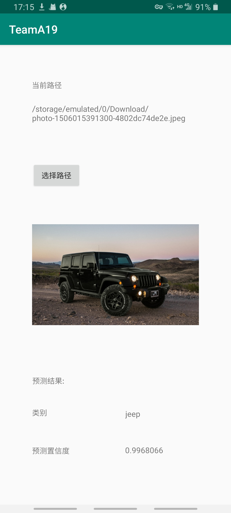

# mobilenet_android_app
mobilenet app on android

this app is really simple,it reads a picture from your device and uses mobilenet to process,then gives back the predict answer and confidence

chinese：这个app使用mobilenet识别你选择的图片然后给出最有可能的分类结果与置信度

### techniques:
android studio
mobilenet from pytorch
tflite to plant the module into app

### requirements:
android SDK >=27
android >= 8.0(may run under 8.0 but not guaranted)

### Run the app
run the app-debug.apk

### screenshots
 
